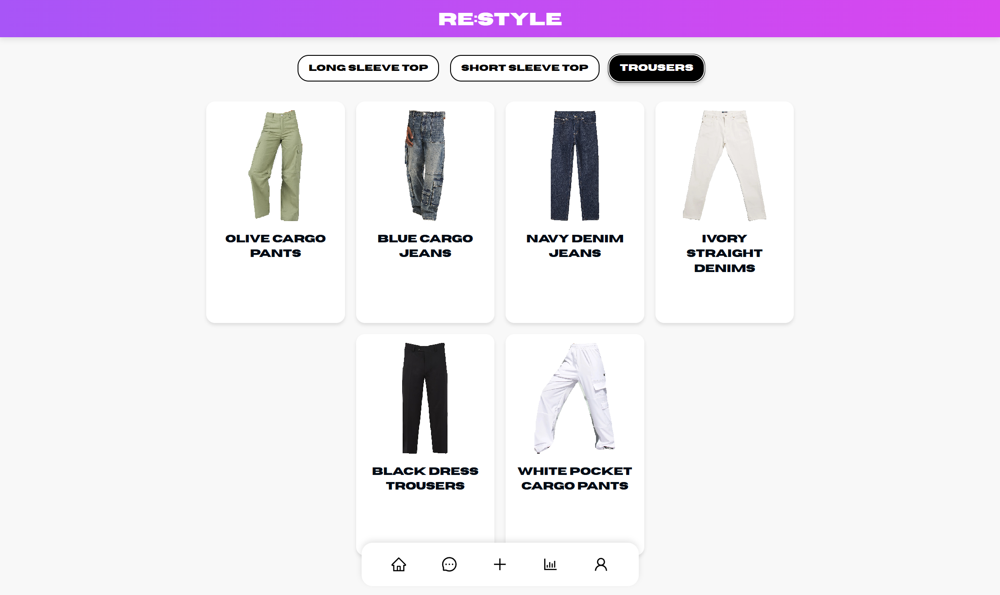

# Welcome to Re:Style!

Re:Style is an innovative, AI-powered platform designed to digitise your wardrobe, provide smart outfit recommendations, and promote sustainable fashion choices through AI-powered thrift store integration and fashion analytics.

## Key Features:

- AI-Powered Clothing Recognition – Instantly detects and categorises clothing from uploaded images.
- Digital Wardrobe Management – Easily browse and organise your clothes.
- Outfit Reuse Tracking – See your most and least worn outfits.
- AI Fashion Assistant – Get real-time outfit recommendations based on weather, occasion, and your existing wardrobe.
- Thrift Store Integration – Discover and shortlist sustainable fashion options from local thrift stores.

## How Does Re:Style Work?

Re:Style allows users to upload images of their clothing, which are then processed using AI to identify and categorise each piece into a digital wardrobe.

The AI model suggests outfits based on your wardrobe, factoring in usage history, personal style, and environmental conditions. To promote sustainability, users can track clothing usage, swap underused items, and explore second-hand fashion through integrated thrift store listings.

Our thrift store feature enables second-hand retailers to list available inventory, making it easy for users to explore, compare, and shortlist items. Combined with AI-powered recommendations, Re:Style ensures users can make eco-conscious fashion choices with just a tap.

## Demo Usage

The demo provided allows users to upload a dataset of their wardrobe, interact with the AI assistant, and browse thrift store options. Follow these steps to test:

1. Run the app
2. Start taking photos of yourself as you are dressed for the day.
3. Navigate easliy as AI registers and categorises the outfits.

4. Interact with the AI assistant to receive outfit recommendations.

5. Refer to the Give Back section where you get notified on some of your unused items

6. If you decide to click Donate, have acess to the

## Experience with AI & Sustainability

Building Re:Style has been an exciting journey. We leveraged AI-powered image recognition and data analytics to help users make better fashion decisions while supporting sustainable shopping practices.

Although implementing AI-driven clothing recognition and thrift store integrations posed challenges, our experience with machine learning, data processing, and sustainable fashion technologies has been incredibly rewarding.

Thank you for the opportunity to explore the intersection of fashion, AI, and sustainability!

## Contact

👤 Kerem Uygun – keremuygun86@gmail.com
👤 Tom Shtaseo – veschi@gmail.com
👤 Wilbert Tham – wilbertthxm@gmail.com
👤 Harry Day – hdkeyworth@gmail.com

